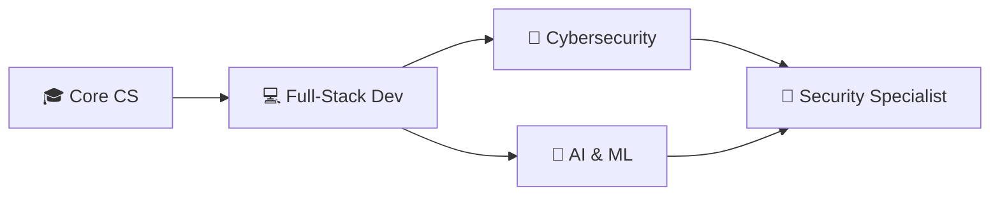

## 👨‍💻 About Me

Software Engineering student from **El Salvador 🇸🇻** passionate about building secure and intelligent systems.

🎯 **Specializing in:** Cybersecurity 🔐 & Artificial Intelligence 🤖  
💡 **Philosophy:** Continuous learning through hands-on projects  
🌎 **Motto:** "Always Learning, Always Growing"

---

## 🛠️ Tech Stack

### Languages

### Tools

### Exploring

---

## 🎯 Current Focus

- 💻 Building **full-stack web applications**
- 🔒 Learning **security best practices** and penetration testing
- 🤖 Exploring **AI/ML fundamentals** and practical applications
- 📚 Strengthening **data structures & algorithms**

---

## 📊 GitHub Stats

 

---

## 🚀 Learning Roadmap

---

