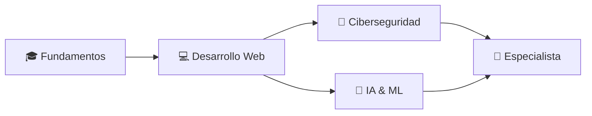

  
  
  

## 👨‍🎓 Sobre Mí

Soy un **estudiante universitario** apasionado por la tecnología y el desarrollo de software. Actualmente me encuentro en mi etapa de formación en **Ingeniería en Desarrollo de Software**, construyendo bases sólidas en programación y desarrollo web. 

🎯 **Mi objetivo**: Especializarme en dos áreas que me fascinan: **Ciberseguridad** 🔐 e **Inteligencia Artificial** 🤖

💡 **Mi enfoque**: Aprendizaje constante y mejora continua  
📍 **Ubicación**: El Salvador 🇸🇻

## 📚 Lo Que Estoy Aprendiendo

### Lenguajes en Progreso

### Herramientas de Desarrollo

### Intereses Futuros

## 🎯 Objetivos Actuales

- 📖 **Dominar los fundamentos**: Java, JavaScript, HTML y CSS
- 💻 **Crear proyectos prácticos** para aplicar lo aprendido en la universidad
- 🌐 **Desarrollar aplicaciones web** funcionales y responsivas
- 📱 **Explorar desarrollo frontend y backend**
- 🔒 **Iniciarme en conceptos básicos de ciberseguridad**
- 🤖 **Comprender los fundamentos de la Inteligencia Artificial**

## 📊 Estadísticas de GitHub

  
  

  

## 🚀 Mi Camino Académico

**Etapa Actual**: Construyendo bases sólidas en programación  
**Próximo Nivel**: Proyectos más complejos y especializaciones avanzadas

## 💡 Filosofía de Aprendizaje

## 📂 Proyectos Universitarios

Este espacio está en construcción 🏗️  
Próximamente compartiré proyectos de:
- Aplicaciones web con HTML, CSS y JavaScript
- Programas en Java
- Ejercicios y prácticas universitarias
- Proyectos personales de aprendizaje

## 📫 Conectemos

  
  ### 🌱 Siempre Aprendiendo, Siempre Creciendo
  
  
  
  
  
  **¡Gracias por visitar mi perfil!** ⭐
  

