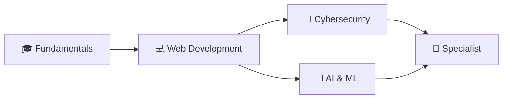

  
  
  

## 👨‍🎓 About Me

I'm a **university student** passionate about technology and software development. Currently pursuing my degree in **Software Development Engineering**, building solid foundations in programming and web development.

🎯 **My Goal**: Specialize in two fascinating areas: **Cybersecurity** 🔐 and **Artificial Intelligence** 🤖

💡 **My Approach**: Continuous learning and constant improvement  
📍 **Location**: El Salvador 🇸🇻

## 📚 Currently Learning

### Languages in Progress

### Development Tools

### Future Interests

## 🎯 Current Goals

- 📖 **Master the fundamentals**: Java, JavaScript, HTML and CSS
- 💻 **Build practical projects** to apply university knowledge
- 🌐 **Develop functional and responsive web applications**
- 📱 **Explore frontend and backend development**
- 🔒 **Start learning basic cybersecurity concepts**
- 🤖 **Understand the fundamentals of Artificial Intelligence**

## 📊 GitHub Stats

  
  

  

## 🚀 My Academic Path

**Current Stage**: Building solid programming foundations  
**Next Level**: More complex projects and advanced specializations

## 📂 University Projects

This space is under construction 🏗️  
Coming soon, projects about:
- Web applications with HTML, CSS and JavaScript
- Java programs
- University exercises and practices
- Personal learning projects

  
  ### 🌱 Always Learning, Always Growing
  
  
  
  
  
  **Thanks for visiting my profile!** ⭐
  

