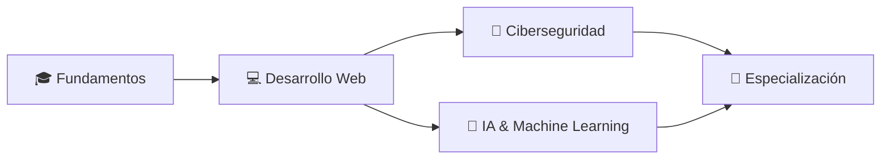

<h1>¡Hola! Soy Isvi Castillo 👋</h1>

  Estudiante de Ingeniería en Desarrollo de Software con interés en
  Ciberseguridad y Inteligencia Artificial. Me apasiona aprender con proyectos
  reales, colaborar en equipo y compartir lo que aprendo.

---

## 🚀 Sobre mí

- Nombre: Isvi Castillo  
- País: El Salvador 🇸🇻  
- Perfil: Estudiante de Ingeniería en Desarrollo de Software  
- Intereses principales: Ciberseguridad, Inteligencia Artificial, Desarrollo Web

Mi enfoque es combinar la teoría que aprendo en la universidad con proyectos prácticos. Busco oportunidades para colaborar, mejorar mi portafolio y especializarme en seguridad y modelos de IA.

---

## 🧰 Tecnologías y herramientas

Lenguajes:
- Java, JavaScript, HTML5, CSS3

Herramientas:
- Git, GitHub, Visual Studio Code, IntelliJ IDEA

Intereses y áreas a aprender:
- Ciberseguridad, Machine Learning, Frameworks web modernos

Badges:

---

## 🔭 Proyectos destacados

Aquí puedes listar tus proyectos con una línea descriptiva y enlace al repo o demo. Ejemplo:

- [Proyecto-1](https://github.com/IsviCastillo/proyecto-1) — Aplicación web para ...
- [Proyecto-2](https://github.com/IsviCastillo/proyecto-2) — Herramienta de análisis de ...

(Si quieres, puedo ayudarte a añadir las entradas reales con descripción y capturas.)

---

## 🎯 Objetivos actuales

- Fortalecer fundamentos en Java, JavaScript, HTML y CSS.
- Construir proyectos prácticos que demuestren buenas prácticas.
- Aprender principios de Ciberseguridad y herramientas básicas.
- Empezar a aplicar conceptos básicos de IA y Machine Learning.

---

## 📫 Contacto

- GitHub: https://github.com/IsviCastillo  
- Email: (añadir correo)  
- LinkedIn / Twitter: (añadir enlaces si los usas)

Si quieres que añada enlaces y correo, compártelos y los incluyo.

---

## 🤝 Cómo colaborar

- Abre un issue si encuentras un bug o quieres proponer una mejora.
- Si quieres contribuir, haz un fork, crea una rama con tu cambio y envía un PR con una descripción clara.
- Etiqueta issues con "good first issue" si quieres que te proponga tareas para principiantes.

---

## 📊 Mis estadísticas en GitHub

 

---

## 🗺️ Roadmap (a corto plazo)

---

## 📌 Nota final

Este README está pensado para ser claro, fácil de mantener y atractivo para quien visite tu perfil. Puedo:
- Añadir enlaces a tus proyectos reales y capturas.
- Subir esta versión al repo en una rama y abrir un PR.
- Traducirlo al inglés o crear una versión bilingüe.

¿Quieres que haga el commit y abra un pull request con esta versión?
